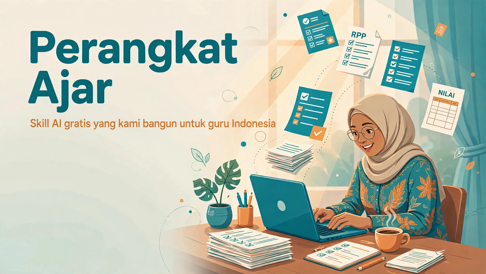

# Perangkat Ajar

**Skill AI open source yang kami rancang dan bangun khusus untuk guru Indonesia, dari Capaian Pembelajaran sampai rapor.**


## Keresahan Kami

Jam 11 malam, laptop masih menyala. Besok pagi modul ajar harus sudah jadi, minggu depan supervisi, leger nilai belum kelar. Sementara mengajar di kelas tetap jalan setiap hari.

Ini bukan cerita satu guru. Ini cerita hampir semua guru di Indonesia:

- Administrasi pembelajaran menumpuk: ATP, modul ajar, LKPD, soal, analisis nilai, deskripsi rapor.
- Setiap dokumen saling berkaitan, tapi dikerjakan terpisah dan rawan tidak konsisten.
- Setiap sekolah punya format dan kebijakan sendiri, template generik sering tidak kepakai.
- Waktu yang habis untuk dokumen adalah waktu yang hilang dari murid.

Kami percaya teknologi seharusnya meringankan, bukan menambah beban. Makanya proyek ini dibuat: gratis, terbuka, dan dibangun dari kebutuhan nyata guru.

## Apa Ini?

`perangkat-ajar` adalah paket skill AI open source yang kami rancang dan bangun sendiri dari nol, khusus untuk kebutuhan guru di Indonesia. Isinya 17 skill yang mengikuti alur kerja guru secara runtut: analisis Capaian Pembelajaran, Alur Tujuan Pembelajaran, program tahunan dan semester, modul ajar, LKPD, soal dan asesmen, pengolahan nilai, sampai deskripsi rapor.

Setiap skill kami tulis berdasarkan alur administrasi guru yang sebenarnya. Ini bukan template generik, dan bukan kumpulan skill buatan orang lain.

AI membantu membuat draf, merapikan alur, menghitung, dan memeriksa konsistensi. Keputusan tetap di tangan guru: tujuan, strategi, penilaian, dan penyesuaian dengan murid serta kebijakan sekolah.

## Gratis, Untuk Guru Indonesia

Proyek ini dikerjakan secara gratis untuk guru-guru di Indonesia. Tidak ada biaya, tidak ada paywall. Kalau ini membantu pekerjaanmu, bantu sebarkan ke rekan guru yang lain.

## Fitur Utama

- 17 skill mencakup alur hulu sampai hilir: CP, ATP, Prota, Prosem, KKTP, RPP/Modul Ajar, LKPD, media ajar, soal dan asesmen, pengolahan nilai, rapor, P5, PKL, riset bahan ajar, administrasi, sampai modul wali kelas.
- Mengikuti format resmi sekolah masing-masing, bukan memaksa template bawaan.
- Pemeriksaan otomatis: alokasi JP, komposisi soal, kunci jawaban, sampai hasil PDF.
- Markdown sebagai sumber utama: revisi cukup edit file sumber, lalu generate ulang.
- Data murid diperlakukan sebagai data sensitif dan tetap dalam kendali guru.

## Mulai Cepat

```bash
# salin folder skill yang kamu butuhkan ke direktori skills
# di asisten AI yang kamu gunakan
cp -r perangkat-ajar/pa-* <direktori-skills-asisten-AI>/

# dependensi pipeline PDF (sekali saja)
pip install markdown-it-py weasyprint
```

1. Bilang ke asisten AI: *"Bantu aku bikin perangkat ajar"* untuk intake profil (nama, sekolah, mapel, JP per minggu, tahun pelajaran, minggu efektif). Profil ini disimpan sekali di awal.
2. Sebutkan dokumen yang mau dibuat: *"Bikin ATP"*, *"Susun prosem"*, *"Buatkan modul ajar TP1"*.
3. Semua dokumen tersimpan sebagai `.md` + `.pdf` di folder output. Revisi cukup edit `.md` lalu generate ulang.

## Prinsip

- **Guru memegang kendali.** AI menyusun dan memeriksa, guru yang memutuskan.
- **Konteks sekolah jadi rujukan.** Format resmi dan kalender pendidikan didahulukan.
- **Mulai dari kebutuhan nyata.** Boleh masuk di titik mana pun, tidak harus dari awal.
- **Konsistensi bisa diverifikasi.** Bukan sekadar dicek dengan mata.

## Berkontribusi

Kontribusi sangat terbuka: perbaikan skill, template format sekolah baru, dokumentasi, atau laporan bug. Silakan buka issue atau kirim pull request.

## Kredit

- **Dikonsep dan dibangun oleh:** Pratomo Bowo Leksono
- **Kontributor:** Bagus Abdul Karim, pembaruan skill dan penyusun alur administrasi guru

Dikembangkan dari kebutuhan nyata guru dan terus disempurnakan lewat pemakaian serta masukan komunitas.

## Lisensi

Proyek ini dilisensikan di bawah [MIT License](LICENSE).
